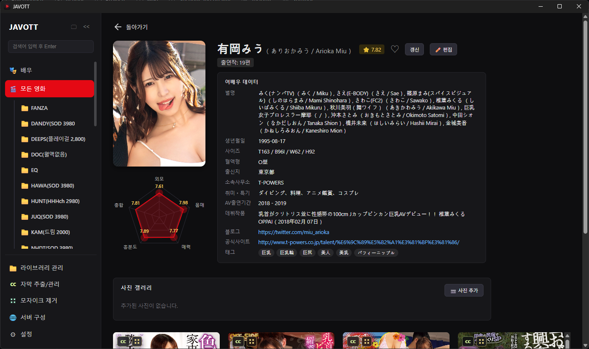

# JAVOTT

**한국어** · [English](README.en.md)

JAVOTT는 로컬에 저장된 동영상 파일을 라이브러리로 관리하는 Windows 데스크톱 앱입니다. 폴더를 등록하면 포스터, 줄거리, 배우, 태그 같은 메타데이터를 채우고, 자막 추출, 모자이크 제거, 내장 재생, 원격 브라우저 재생까지 한 앱 안에서 처리할 수 있습니다.

실행 중인 PC를 서버로 켜면 같은 네트워크의 TV, 휴대폰, 노트북 브라우저에서도 라이브러리에 접속할 수 있습니다.

> 이 저장소는 JAVOTT의 설치 파일 배포 전용 저장소입니다. 소스 코드는 포함되어 있지 않습니다.

> 주의: JAVOTT는 성인 콘텐츠가 포함될 수 있는 개인 미디어 라이브러리 관리 도구입니다. 거주 지역의 법령, 저작권, 성인 콘텐츠 소지 및 시청 관련 규정을 지키는 책임은 사용자에게 있습니다. 원격 접속 기능을 켜는 경우 관리자 비밀번호와 웹 PIN을 반드시 설정해 미성년자와 허가되지 않은 접근을 차단하세요.

## 0.1.3 변경사항

0.1.3은 0.1.2 대비 배우 정보, 번역/매핑 관리, 자동화 기본값, 도구 실행 안정성을 크게 보강한 업데이트입니다.

- 배우 전용 화면을 추가했습니다. 배우 목록, 배우 상세 페이지, 대표 사진, 프로필 정보, 출연작을 더 쉽게 확인할 수 있습니다.
- 온라인 배우 프로필 스크랩을 추가했습니다. 이름 읽기, 별칭, 생년월일, 신체 정보, 활동 기간, 평점 등 배우 메타데이터를 가져옵니다.
- 배우 프로필 스크랩 시 사진이 없는 배우는 대표 이미지를 함께 채웁니다.
- 설정에 번역 제공자 구성을 추가했습니다. Google 무료/Cloud, DeepL, Papago 등 제공자를 선택하고 테스트 번역을 실행할 수 있습니다.
- 장르 및 태그/세트명 매핑을 앱 안에서 직접 편집할 수 있게 했습니다. 텍스트 파일을 열어 수동 import하던 흐름 대신, 미번역 항목을 검색하고 저장하면 라이브러리에 즉시 반영됩니다.
- 스캔 또는 메타데이터 갱신 후 새 장르, 태그, 세트명이 매핑 파일에 자동으로 추가되고 기존 번역이 DB에 다시 적용됩니다.
- 새로 감지된 파일의 온라인 메타데이터 자동 갱신 기본값을 켜짐으로 변경했습니다.
- LADA 및 Faster-Whisper-XXL 같은 외부 도구 실행 로그의 UTF-8 출력 처리를 개선했습니다.

## 목차

- [주요 기능](#주요-기능)
- [설치](#설치)
- [빠른 시작](#빠른-시작)
- [화면 안내](#화면-안내)
  - [모든 영화](#모든-영화)
  - [배우](#배우)
  - [재생 화면](#재생-화면)
  - [라이브러리 관리](#라이브러리-관리)
  - [라이브러리 폴더 관리](#라이브러리-폴더-관리)
  - [자막 추출](#자막-추출)
  - [모자이크 제거](#모자이크-제거)
  - [서버 구성](#서버-구성)
  - [설정](#설정)
- [FAQ 및 문제 해결](#faq-및-문제-해결)
- [라이선스와 서드파티 고지](#라이선스와-서드파티-고지)

## 주요 기능

- 폴더 단위 라이브러리: 동영상이 들어 있는 폴더를 등록하고 스캔하면 라이브러리에 자동으로 추가됩니다. 하위 폴더 포함 여부와 코덱 분석 여부를 선택할 수 있습니다.
- 포스터 중심 탐색: 검색, 정렬, 필터, 즐겨찾기, 포스터 크기 조절, 제목 표시 줄 수 조절을 지원합니다.
- 온라인 메타데이터 자동 수집: 파일명에서 품번을 인식해 포스터, 팬아트, 줄거리, 장르, 태그, 배우 정보를 가져옵니다.
- 배우 프로필: 배우 목록과 상세 페이지에서 대표 사진, 프로필 정보, 출연작을 확인하고 온라인 프로필 스크랩을 실행할 수 있습니다.
- NFO 기반 메타데이터: Kodi/Jellyfin 계열 도구와 호환되는 NFO 파일로 메타데이터를 저장하고 동기화합니다.
- 내장 플레이어와 외부 플레이어: 앱 내 재생 화면을 제공하며, 필요하면 VLC, PotPlayer 등 외부 플레이어로 바로 넘길 수 있습니다.
- 라이브러리 그리드 편집: 스프레드시트처럼 셀을 직접 편집하고, 여러 값을 복사/붙여넣기 또는 일괄 채우기 할 수 있습니다.
- 번역 및 매핑 관리: 장르, 태그, 세트명 번역을 앱 안에서 검색/편집하고 저장 즉시 반영할 수 있습니다.
- 자막 추출: Faster-Whisper-XXL 기반으로 자막이 없는 영상을 큐에 넣어 자동 추출할 수 있습니다.
- 모자이크 제거: LADA 기반 모자이크 제거 작업을 큐로 관리하고 진행 상황을 실시간으로 확인할 수 있습니다.
- 원격 접속 서버: 내장 HTTPS 서버를 통해 다른 기기의 브라우저에서 라이브러리를 볼 수 있습니다. 관리자 비밀번호, 웹 PIN, Windows 인증서 발급 배치 생성도 지원합니다.

## 설치

1. [Releases](../../releases)에서 최신 Windows 설치 파일(`JAVOTT_x.x.x_x64-setup.exe`)을 다운로드합니다.
2. 설치 파일을 실행합니다. 설치 중 FFmpeg를 함께 설치할지 선택할 수 있습니다.
   - FFmpeg는 코덱 분석과 일부 실시간 변환 재생에 사용됩니다.
   - 설치를 건너뛰어도, 나중에 시스템에 FFmpeg가 설치되어 있으면 JAVOTT가 자동으로 찾아 사용합니다.
3. 설치가 끝나면 JAVOTT를 실행합니다.

### 시스템 요구 사항

- Windows 10/11 x64
- 온라인 메타데이터, 배우 프로필, 번역, 원격 접속 기능에는 인터넷 연결이 필요합니다.
- 모자이크 제거는 GPU, 특히 NVIDIA CUDA 환경에서 훨씬 빠릅니다. CPU만으로도 동작하지만 시간이 오래 걸릴 수 있습니다.

## 빠른 시작

1. **라이브러리 폴더 관리**에서 동영상 폴더를 추가합니다.
2. **라이브러리 스캔**을 실행해 동영상 파일을 등록합니다.
3. **모든 영화** 화면에서 포스터 그리드로 라이브러리를 확인합니다.
4. 메타데이터가 비어 있거나 잘못된 항목은 **라이브러리 관리**에서 직접 수정하거나 메타데이터 갱신을 실행합니다.
5. 배우 정보가 필요하면 **배우** 화면에서 프로필 스크랩을 실행합니다.
6. 장르, 태그, 세트명 번역은 **설정 > 장르 매핑 / 태그·세트 매핑**에서 편집합니다.
7. 자막이 없는 영상은 **자막 추출**, 모자이크 처리가 필요한 영상은 **모자이크 제거** 큐에 추가합니다.
8. 다른 기기에서 보고 싶다면 **서버 구성**에서 서버를 켜고 접속 주소를 확인합니다.

## 화면 안내

왼쪽 사이드바에서 주요 화면을 이동할 수 있습니다. 스캔이나 메타데이터 갱신이 진행 중이면 어느 화면에 있든 하단 팝업에서 진행 상황과 중단 버튼을 확인할 수 있습니다.

### 모든 영화

등록된 영화를 포스터 중심 갤러리로 탐색하는 메인 화면입니다.

- 전체 라이브러리 또는 특정 라이브러리별 보기
- 제목, 원제, 배우, 장르, 제작사 검색 및 필터
- 최근 추가, 출시일, 제목, 평점, 재생 횟수 기준 정렬
- 즐겨찾기, 자막 보유 여부, 모자이크 상태 배지 표시
- 영화를 선택하면 상세 페이지에서 전체 메타데이터와 출연 배우를 확인하고 재생할 수 있습니다.

### 배우

배우별로 라이브러리를 탐색하고 프로필을 관리하는 화면입니다.

- 등록된 배우 목록과 대표 사진 표시
- 배우 상세 페이지에서 출연작, 이름 읽기, 별칭, 생년월일, 신체 정보, 활동 기간 등 확인
- 온라인 프로필 스크랩으로 누락된 배우 정보를 채움
- 사진이 없는 배우는 프로필 스크랩 과정에서 대표 이미지를 함께 다운로드

### 재생 화면

영화를 클릭하면 열리는 내장 플레이어입니다.

- 재생/일시정지, 음소거, 구간 이동, 볼륨, 전체 화면, 이어보기, 자막 토글, 블랙 스크린
- 재생 위치 자동 저장
- 단축키를 설정에서 자유롭게 변경 가능
- 외부 플레이어를 등록하면 재생 버튼을 VLC, PotPlayer 등으로 연결할 수 있습니다.
- 서버에서 트랜스코딩을 켜면 재생 기기가 지원하지 않는 코덱을 실시간 변환할 수 있습니다.

### 라이브러리 관리

영화 메타데이터를 표 형태로 보고 편집하는 화면입니다.

- 컬럼 너비, 표시 여부, 순서 변경
- 셀 직접 편집, 여러 셀 복사/붙여넣기, 일괄 채우기
- 제목, 원제, 제작사, 감독, 연도, 평점, 줄거리, 장르, 태그, 배우, 자막 언어, 모자이크 상태 편집
- 선택한 영화의 메타데이터 갱신, 외부 재생, 영구 삭제, 자막 보기, 자막 추출/모자이크 제거 큐 추가
- 새 파일 감지 시 기본 NFO를 만들고, 설정에 따라 온라인 메타데이터 갱신도 자동 실행합니다.

### 라이브러리 폴더 관리

라이브러리의 실제 폴더를 추가하고 관리하는 화면입니다.

- 폴더 추가, 이름 변경, 순서 변경, 제거
- 하위 폴더 포함 여부를 선택해 스캔
- 코덱 분석 여부 선택
- 전체 메타데이터 갱신 및 NFO 다시 쓰기
- 스캔과 갱신 작업은 진행 중 언제든 중단할 수 있습니다.

### 자막 추출

Faster-Whisper-XXL 기반 자막 추출 작업을 관리합니다.

- 도구 설치 또는 로컬 번들 등록
- 라이브러리 영화 또는 임의 파일을 큐에 추가
- 언어, 모델, 출력 형식, 실행 장치 설정
- 시작, 일시정지, 취소, 삭제, 재시도, 순서 변경
- 진행률과 로그 확인

### 모자이크 제거

LADA 기반 모자이크 제거 작업을 큐로 관리합니다.

- NVIDIA/Intel 패키지 설치
- 출력 폴더, 임시 폴더, 출력 파일명 패턴 설정
- 인코더와 옵션 프리셋 저장
- cuda/cpu 장치 선택
- 해상도, FPS, 처리 속도, 예상 남은 시간 표시
- 완료 시 해당 영화의 모자이크 상태가 자동으로 Reduced로 바뀝니다.

### 서버 구성

PC를 서버로 켜서 다른 기기의 브라우저에서 라이브러리에 접속하게 합니다.

- 포트, 공개 도메인, 공개 포트 설정
- Windows 로그인 시 서버 자동 시작
- 관리자 비밀번호와 웹 PIN 설정
- DuckDNS 도메인용 Windows 인증서 자동 발급 배치 파일 생성
- Windows 방화벽 인바운드 포트 열기

> 서버 기능은 앱을 네트워크에 노출합니다. 외부 접속까지 열 경우 관리자 비밀번호와 웹 PIN을 반드시 설정하세요.

### 설정

앱 전반의 동작을 조정하는 화면입니다.

- 언어 설정
- 라이브러리 자동화: 새 파일 온라인 메타데이터 자동 갱신 여부
- 번역 제공자 설정 및 테스트 번역
- 재생: 이어보기 확인, 자동 재생
- 외부 플레이어 등록 및 단축키 변경
- 시스템 정보와 오픈소스 고지 확인
- 장르 매핑, 태그/세트 매핑 편집

## FAQ 및 문제 해결

**라이브러리에 영화가 보이지 않습니다.**

라이브러리 폴더 경로가 맞는지, 지원되는 동영상 확장자인지 확인한 뒤 라이브러리 스캔을 다시 실행하세요.

**포스터나 메타데이터가 이상합니다.**

라이브러리 관리에서 해당 영화를 선택하고 메타데이터 갱신을 실행하거나, 그리드에서 값을 직접 수정하세요.

**배우 정보가 비어 있습니다.**

배우 화면에서 프로필 스크랩을 실행하세요. 이미 조회된 배우는 스킵되며, 사진이 없는 배우는 대표 이미지 다운로드도 함께 시도합니다.

**장르나 태그 번역이 적용되지 않습니다.**

설정의 장르 매핑 또는 태그/세트 매핑에서 원본 항목의 번역을 입력하고 저장하세요. 스캔이나 메타데이터 갱신 후 새 항목은 자동으로 매핑 목록에 추가됩니다.

**자막 보기 버튼이 비활성화되어 있습니다.**

영상 옆에 자막 파일이 없다는 뜻입니다. 자막 추출 화면에서 해당 영상을 큐에 추가해 보세요.

**자막 추출 또는 모자이크 제거가 실패합니다.**

Faster-Whisper-XXL 또는 LADA가 설치되어 있는지, 실행 장치 설정이 PC 환경과 맞는지 확인하고 로그의 오류 메시지를 확인하세요.

**원격 접속이 되지 않습니다.**

서버가 실행 중인지, 앱이 표시한 접속 주소를 사용 중인지, Windows 방화벽 포트가 열려 있는지 확인하세요. 외부 인터넷에서 접속하려면 공유기 포트포워딩과 인증서 설정도 확인해야 합니다.

**진행 중인 스캔이나 메타데이터 갱신을 멈추고 싶습니다.**

하단 진행 팝업의 중단 버튼을 누르세요. 현재 처리 중인 항목을 마친 뒤 나머지 작업을 취소합니다.

## 라이선스와 서드파티 고지

- JAVOTT는 closed-source 소프트웨어입니다. 이 저장소는 실행 파일 배포 목적으로만 사용되며, 소스 코드에 대한 권리는 제공하지 않습니다.
- 설치 중 선택적으로 내려받는 FFmpeg는 [BtbN FFmpeg-Builds](https://github.com/BtbN/FFmpeg-Builds)의 win64 `lgpl-shared` 빌드이며 GNU LGPL로 배포됩니다. 전체 라이선스와 소스 안내는 설치 후 앱의 설정 화면과 설치 폴더의 `ffmpeg/licenses/`, `THIRD_PARTY_NOTICES.txt`, `SOURCE-OFFER.txt`에서 확인할 수 있습니다.
- 자막 추출은 [Faster-Whisper-XXL](https://github.com/Purfview/whisper-standalone-win), 모자이크 제거는 [LADA](https://github.com/ladaapp/lada)를 별도 도구로 호출합니다. 각 도구의 라이선스는 해당 프로젝트를 따릅니다.
