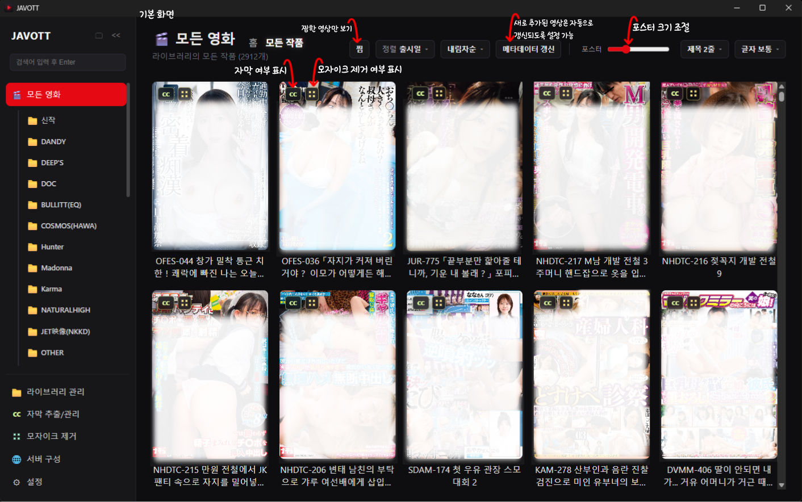
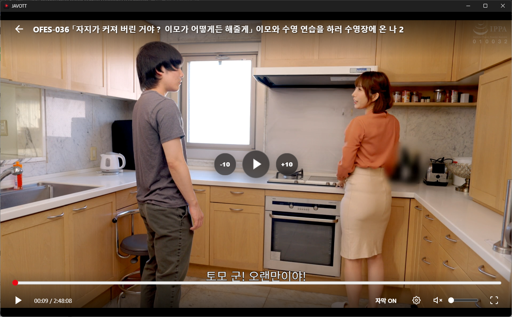
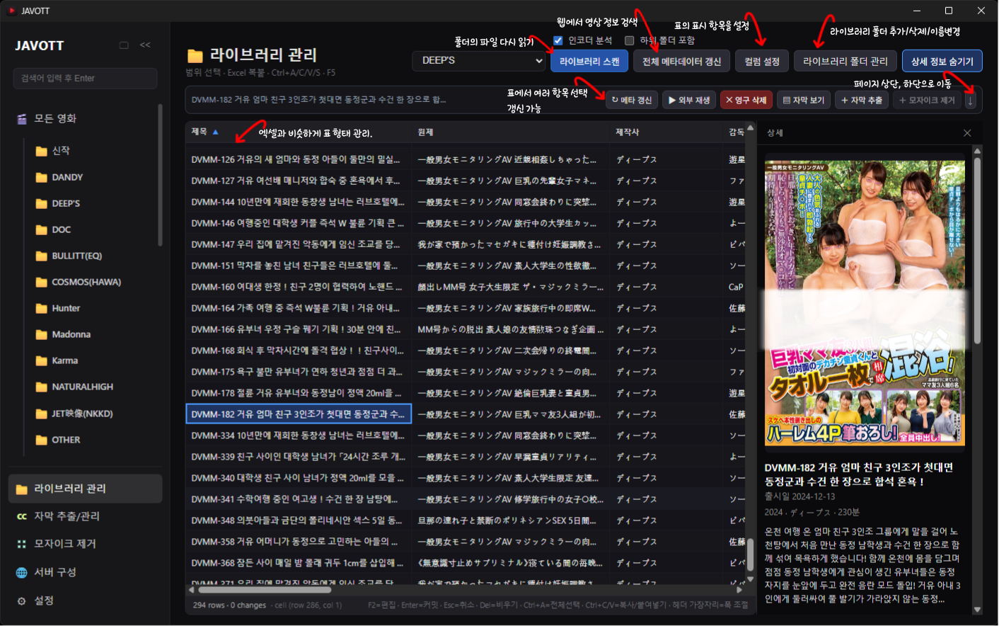
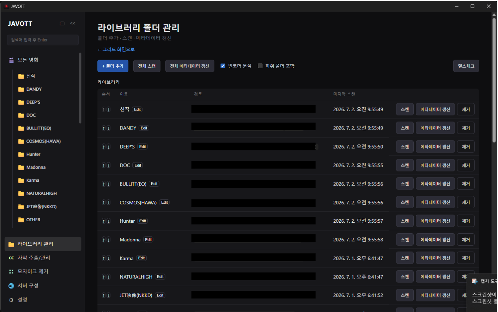
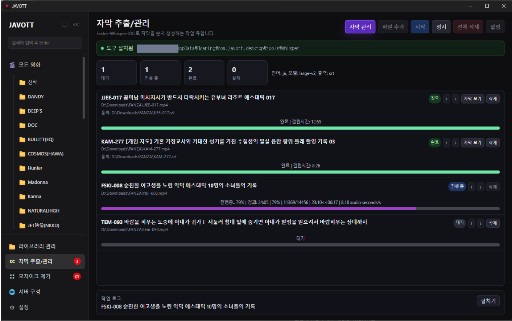
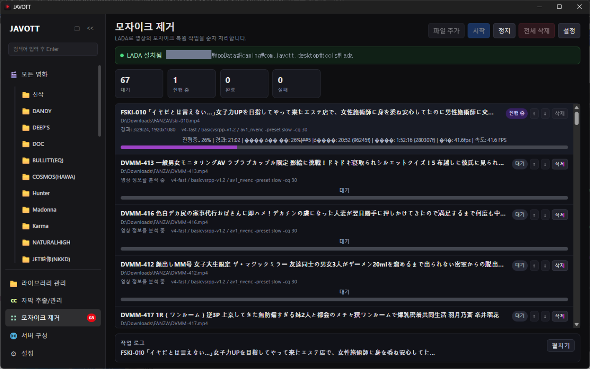
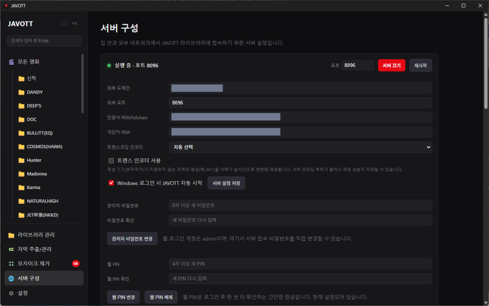
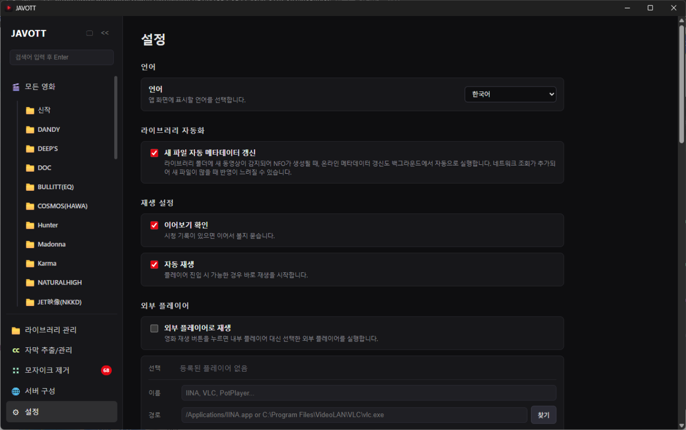

# JAVOTT

**한국어** · [English](README.en.md)

로컬에 저장된 영상 파일을 라이브러리로 관리하는 데스크톱 미디어 라이브러리 앱입니다. 폴더를 등록하면 포스터·줄거리·배우 같은 메타데이터를 자동으로 채워주고, 자막 추출·모자이크 제거·원격 재생까지 한 앱에서 처리합니다.

Windows용 데스크톱 앱이며, 실행 중인 PC를 서버로 켜면 같은 네트워크나 인터넷을 통해 다른 기기(TV, 폰, 노트북)의 브라우저에서도 라이브러리에 접속할 수 있습니다.

> 이 저장소는 JAVOTT의 **설치 파일 배포 전용** 저장소입니다. 소스 코드는 비공개이며 이 저장소에는 포함되어 있지 않습니다.

> ⚠️ **주의**: JAVOTT는 성인 콘텐츠를 포함한 개인 미디어 라이브러리 관리용 도구입니다. 이 앱을 사용하려면 거주 지역의 법령상 성인 콘텐츠 소지·시청이 허용되는 연령이어야 하며, 콘텐츠의 저작권과 관련 법규를 준수할 책임은 전적으로 사용자에게 있습니다. 원격 접속 기능을 켤 때는 반드시 관리자 비밀번호와 웹 PIN을 설정해 미성년자나 제3자의 접근을 막아주세요.

## 목차

- [주요 기능](#주요-기능)
- [설치하기](#설치하기)
- [빠른 시작](#빠른-시작)
- [화면별 안내](#화면별-안내)
  - [모든 영화](#-모든-영화)
  - [재생 화면](#-재생-화면)
  - [라이브러리 관리](#-라이브러리-관리)
  - [라이브러리 폴더 관리](#-라이브러리-폴더-관리)
  - [자막 추출/관리](#🅲🅲-자막-추출관리)
  - [모자이크 제거](#-모자이크-제거)
  - [서버 구성](#-서버-구성)
  - [설정](#-설정)
- [자주 묻는 질문 · 문제 해결](#자주-묻는-질문--문제-해결)
- [라이선스와 오픈소스 고지](#라이선스와-오픈소스-고지)

## 주요 기능

- 📁 **폴더 단위 라이브러리** — 영상이 들어있는 폴더를 등록하면 스캔해서 자동으로 목록에 추가합니다. 하위 폴더까지 포함할지 선택할 수 있고, 스캔/메타데이터 갱신은 언제든 중단할 수 있습니다.
- 🖼 **포스터 중심 탐색 화면** — 정렬·필터·즐겨찾기, 포스터 크기 슬라이더, 제목 표시 줄 수까지 취향대로 맞춰볼 수 있는 갤러리 화면입니다.
- ▶ **내장 플레이어 + 외부 플레이어 연동** — 자체 재생 화면과 단축키를 제공하며, 원하면 IINA·VLC·PotPlayer 같은 외부 플레이어로 바로 넘길 수 있습니다.
- 🌐 **온라인 메타데이터 자동 채움** — 파일명에서 품번을 인식해 포스터·팬아트·줄거리·배우 정보를 온라인에서 가져와 채웁니다. 새 파일이 감지되면 자동으로 갱신하도록 설정할 수도 있습니다.
- 📝 **NFO 기반 메타데이터** — Kodi/Jellyfin 계열 도구와 호환되는 NFO 파일로 메타데이터를 저장·동기화합니다.
- ⌗⌗ **표 형태의 라이브러리 관리 그리드** — 엑셀처럼 여러 셀을 선택해 복사/붙여넣기·일괄 수정할 수 있는 편집 화면입니다.
- 🅲🅲 **자막 추출** — Faster-Whisper-XXL 기반으로 자막이 없는 영상의 자막을 큐에 올려 자동 추출합니다.
- ▦ **모자이크 제거** — LADA 기반 모자이크 제거 작업을 큐로 관리하고 진행 상황을 실시간으로 확인합니다.
- 🔒 **원격 접속용 내장 서버** — 같은 네트워크나 외부망에서 브라우저로 라이브러리에 접속할 수 있는 HTTPS 서버가 내장되어 있습니다. 관리자 비밀번호, 웹 PIN, Windows 인증서 자동 발급까지 지원합니다.

## 설치하기

1. [Releases](../../releases)에서 최신 Windows 설치 파일(`JAVOTT_x.x.x_x64-setup.exe`)을 내려받습니다.
2. 설치 파일을 실행합니다. 설치 중 **FFmpeg를 함께 설치할지 선택하는 창**이 뜹니다.
   - FFmpeg는 코덱 분석과 AV1 변환 재생 같은 기능에 필요하며, 선택 시 [BtbN FFmpeg-Builds](https://github.com/BtbN/FFmpeg-Builds)의 win64 lgpl-shared 빌드를 내려받아 설치 폴더에 넣습니다.
   - 지금 설치하지 않아도 나중에 시스템에 FFmpeg를 설치해두면 JAVOTT가 자동으로 찾아 사용합니다.
3. 설치가 끝나면 JAVOTT를 실행합니다.

### 시스템 요구 사항

- Windows 10/11 (x64)
- 원격 접속(서버) 기능을 쓰려면 인터넷 연결과 (외부 접속 시) 포트포워딩이 필요합니다.
- 모자이크 제거는 GPU(NVIDIA CUDA 권장)가 있으면 훨씬 빠릅니다. CPU만으로도 동작하지만 느립니다.

## 빠른 시작

1. **라이브러리 폴더 관리**에서 영상이 들어있는 폴더를 추가합니다.
2. **라이브러리 스캔**을 실행해 영상 파일을 인식시킵니다.
3. **모든 영화** 화면에서 포스터 그리드로 라이브러리를 확인합니다.
4. 메타데이터가 비어있거나 틀린 항목은 **라이브러리 관리**에서 직접 고치거나 메타 갱신을 실행합니다.
5. 자막이 없는 영상은 **자막 추출** 큐에, 모자이크 처리가 필요한 영상은 **모자이크 제거** 큐에 추가합니다.
6. **설정**에서 외부 플레이어·단축키·언어를 취향대로 맞춥니다.
7. 다른 기기에서도 보고 싶다면 **서버 구성**에서 서버를 켜고 접속 주소를 확인합니다.

## 화면별 안내

왼쪽 사이드바에서 아래 화면들을 오갈 수 있습니다. 자막 추출·모자이크 제거 큐에 대기 중인 작업이 있으면 메뉴 옆에 숫자 배지가 표시되고, 스캔이나 메타데이터 갱신이 진행 중일 때는 어느 화면에 있든 하단에 진행률 팝업이 뜹니다(다른 화면으로 이동해도 계속 진행되며, 팝업에서 바로 중단할 수 있습니다).

### 🎬 모든 영화

등록된 영화를 포스터 중심 갤러리로 탐색하는 홈 화면입니다.

- 전체/라이브러리별 보기, 검색, 장르·배우·제작사 필터, 즐겨찾기만 보기
- 정렬 기준(최근 추가·출시일·제목·평점·재생 횟수) 및 오름차순/내림차순 전환
- 포스터 크기(슬라이더), 제목 표시 줄 수, 제목 글자 크기 조절
- 포스터에는 즐겨찾기·자막 보유 여부·모자이크 상태(Censored/Uncensored/Reduced) 아이콘이 함께 표시됩니다.
- 영화를 선택하면 상세 화면에서 줄거리·배우·태그 등 전체 메타데이터를 확인하고 바로 재생하거나 즐겨찾기를 전환할 수 있습니다.

### ▶ 재생 화면

영화를 클릭하면 열리는 내장 플레이어 화면입니다.

- 재생/일시정지, 음소거, 구간 이동, 볼륨 조절, 전체 화면, 이어보기, 자막 켜기/끄기, 블랙 스크린, 재생 위치 자동 저장
- 단축키는 설정 화면에서 자유롭게 변경할 수 있습니다.
- **서버 구성 > 트랜스 인코더 사용**을 켜면, 재생 기기가 지원하지 않는 코덱(예: AV1)의 영상을 서버가 실시간으로 변환해 재생합니다. 서버 인코딩 부하가 늘어나 성능이 저하될 수 있으니 필요할 때만 켜세요.
- 설정에서 외부 플레이어(IINA·VLC·PotPlayer 등)를 등록하면 재생 버튼이 내부 플레이어 대신 외부 플레이어를 실행하도록 바꿀 수 있습니다.

### 📁 라이브러리 관리

영화 정보를 표(그리드) 형태로 한눈에 보고 편집하는 화면입니다.

- 컬럼 너비/표시/순서를 자유롭게 조정하고, 헤더 클릭으로 정렬합니다.
- 셀을 직접 편집하거나 여러 셀을 선택해 엑셀처럼 복사/붙여넣기·일괄 채우기(Ctrl+D)할 수 있습니다.
- 제목·원제·제작사·감독·연도·평점·줄거리·장르·태그·배우·자막 언어·모자이크 상태 등을 편집하면 DB와 NFO에 함께 반영됩니다.
- 선택한 영화에 대해 메타 갱신·외부 재생·영구 삭제·자막 보기·자막 추출/모자이크 제거 큐 추가를 실행할 수 있습니다.
- 새 영상 파일이 감지되면 자동으로 최소 NFO가 생성되며, **설정 > 라이브러리 자동화**에서 새 파일의 온라인 메타데이터도 자동으로 갱신하도록 켤 수 있습니다(기본값은 꺼짐 — 네트워크 조회가 늘어 갱신이 느려질 수 있습니다).

### 🗂 라이브러리 폴더 관리

라이브러리 관리 화면에서 이동할 수 있는, 폴더 자체를 등록/관리하는 화면입니다.

- 폴더 추가(다중 선택 가능)·이름 변경·순서 변경·제거
- 라이브러리 스캔(하위 폴더 포함 여부, 인코더/코덱 분석 여부 선택 가능)
- 전체 메타데이터 갱신, NFO 다시 쓰기
- 스캔·갱신 모두 진행 중 언제든 중단할 수 있습니다.

### 🅲🅲 자막 추출/관리

Faster-Whisper-XXL 기반으로 자막을 추출하고 관리하는 화면입니다.

- 도구 설치(다운로드 또는 로컬 번들 복사), 설치 진행률 표시
- 라이브러리 영화나 파일을 큐에 추가해 순서대로 처리
- 언어(일본어/한국어/영어/자동 감지), 모델(medium/large-v2/large-v3), 출력 형식(SRT/VTT), 실행 장치(auto/cpu/cuda) 설정
- 큐 시작/일시정지, 작업 취소/삭제/재시도, 순서 변경, 진행률·로그 확인

### ▦ 모자이크 제거

LADA 기반으로 모자이크 제거 작업을 큐로 관리하는 화면입니다.

- NVIDIA/Intel 패키지 설치, 출력 폴더·임시 폴더·출력 파일명 패턴 설정
- 자주 쓰는 인코더+옵션 조합을 프리셋으로 저장
- 장치(cuda:0/cpu) 등 세부 옵션 설정
- 처리 중 해상도·FPS·처리 속도·예상 남은 시간을 실시간으로 표시
- 작업이 끝나면 해당 영화의 모자이크 상태가 자동으로 Reduced로 바뀝니다.

### 🌐 서버 구성

PC를 서버로 켜서 같은 네트워크의 TV·폰이나, 포트포워딩 후 외부에서도 브라우저로 라이브러리에 접속할 수 있게 하는 화면입니다.

- 포트·공개 도메인·공개 포트 설정, Windows 로그인 시 자동 시작
- 관리자 비밀번호, 웹 PIN(2차 잠금) 설정
- DuckDNS 도메인 기준 Windows 인증서 자동 발급 배치 파일 생성(win-acme 기반)
- Windows 방화벽 인바운드 포트 열기

> 서버 기능은 앱을 네트워크에 노출합니다. 외부에서 접속 가능하게 열 경우 **반드시 관리자 비밀번호와 웹 PIN을 설정**하세요.

### ⚙ 설정

앱 사용 환경 전반을 조정하는 화면입니다.

- 재생: 이어보기 확인, 자동 재생
- 언어: 현재 한국어·영어 1차 지원, 일본어는 기본 구조만 준비됨
- 외부 플레이어 등록/관리, 단축키 변경
- 장르 매핑(일본어 ↔ 한국어)
- 라이브러리 자동화: 새 파일 자동 메타데이터 갱신 여부

## 자주 묻는 질문 · 문제 해결

**라이브러리에 영화가 안 보여요.**
라이브러리 폴더 경로가 맞는지, 지원되는 동영상 확장자인지 확인하고 라이브러리 스캔을 다시 실행해보세요.

**포스터나 메타데이터가 이상해요.**
라이브러리 관리에서 해당 영화를 선택해 메타 갱신을 실행하거나, 그리드에서 직접 값을 고친 뒤 저장하세요.

**자막 보기 버튼이 비활성화돼요.**
영상과 같은 폴더에 자막 파일이 없다는 뜻입니다. 자막 추출 큐에 추가해보세요.

**자막 추출/모자이크 제거가 실패해요.**
해당 도구(Faster-Whisper-XXL / LADA)가 설치됐는지, 장치 설정(cpu/cuda)이 현재 PC와 맞는지 확인하고 로그를 펼쳐 오류 메시지를 확인하세요.

**원격 접속이 안 돼요.**
서버가 실행 중인지, 표시된 접속 주소가 맞는지 확인하고 Windows 방화벽 포트 열기를 실행해보세요. 외부망에서는 공유기 포트포워딩과 인증서 설정도 함께 확인해야 합니다.

**스캔이나 메타데이터 갱신을 멈추고 싶어요.**
작업이 진행 중이면 화면 하단(또는 어느 화면에 있든 뜨는 팝업)에 중단 버튼이 있습니다. 누르면 진행 중이던 항목까지만 처리하고 나머지는 취소됩니다.

## 라이선스와 오픈소스 고지

- JAVOTT는 비공개(closed-source) 소프트웨어입니다. 이 저장소는 실행 파일 배포 목적으로만 사용되며, 소스 코드에 대한 권리는 제공되지 않습니다.
- 설치 시 선택적으로 내려받는 **FFmpeg**는 [BtbN FFmpeg-Builds](https://github.com/BtbN/FFmpeg-Builds)의 win64 `lgpl-shared` 빌드이며 GNU LGPL로 배포됩니다. 라이선스 전문과 소스 안내는 설치 후 앱 설정 화면(오픈소스 고지)과 설치 폴더의 `ffmpeg/licenses/`, `THIRD_PARTY_NOTICES.txt`, `SOURCE-OFFER.txt`에서 확인할 수 있습니다.
- 자막 추출은 [Faster-Whisper-XXL](https://github.com/Purfview/whisper-standalone-win), 모자이크 제거는 [LADA](https://github.com/ladaapp/lada)를 별도 도구로 호출해 사용합니다. 각 도구의 라이선스는 해당 프로젝트를 따릅니다.
